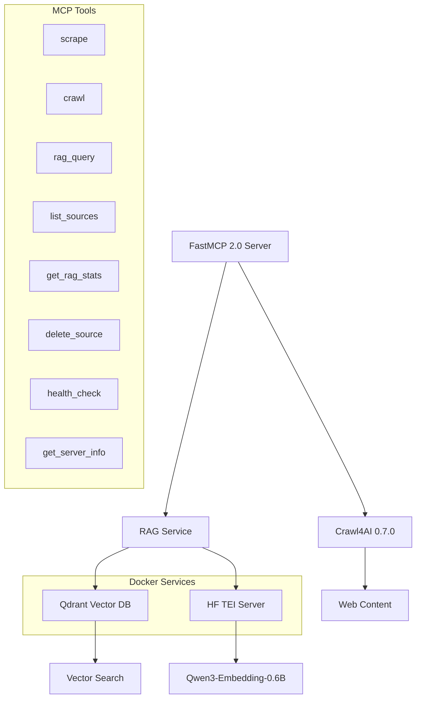

# 🕷️ Crawler MCP - Advanced RAG-Enabled Web Crawling Server

A powerful, production-ready Model Context Protocol (MCP) server that combines advanced web crawling capabilities with semantic search through RAG (Retrieval-Augmented Generation). Built with **FastMCP 2.0**, **Crawl4AI 0.7.0**, **Qdrant vector database**, and **Qwen3-Embedding-0.6B** for multilingual semantic understanding.

[](https://www.python.org/downloads/)
[](https://github.com/jlowin/fastmcp)
[](https://github.com/unclecode/crawl4ai)
[](https://qdrant.tech/)

## ✨ Features

### 🚀 Advanced Web Crawling
- **🎯 Smart Single Page Scraping** - Extract content, metadata, images, and links with AI-powered precision
- **🌐 Site-wide Intelligent Crawling** - Sitemap.xml discovery with adaptive recursive fallback (1000 pages, 3 levels deep by default)
- **📚 Repository Analysis** - Clone and analyze GitHub repositories with code-aware processing
- **📁 Directory Processing** - Local file system crawling with intelligent document format detection
- **🧠 Adaptive Intelligence** - Machine learning-driven crawling that optimizes based on content quality

### 🔍 RAG-Powered Semantic Search
- **🌟 Vector Search** - Lightning-fast semantic similarity using Qwen3-Embedding-0.6B (1024-dim)
- **🏆 AI Reranking** - Advanced result optimization with Qwen3-Reranker-0.6B-seq-cls for superior relevance, with configurable fallback to custom algorithms (see [Configuration](#-configuration))
- **⚡ Hybrid Search** - Combines semantic vectors with keyword-based filtering
- **🧠 Token-Aware Chunking** - Intelligent 1024-token chunks with semantic boundary detection
- **📊 Rich Metadata** - Comprehensive source tracking, timestamps, and context preservation

### 🏗️ Modern Architecture
- **🔥 FastMCP 2.0** - Streamable HTTP transport with real-time progress updates
- **⚡ Qdrant Vector DB** - High-performance vector storage with HNSW indexing
- **🤖 HF TEI Integration** - GPU-accelerated embedding generation (128 concurrent requests)
- **🐳 Docker Compose** - One-command deployment with service orchestration
- **📈 Performance Optimized** - 32K batch tokens, 64 concurrent requests, RTX 4070 optimized

## 🚀 Quick Start

### Prerequisites
- Docker & Docker Compose
- Python 3.9+
- 8GB+ RAM recommended
- NVIDIA GPU (optional, for TEI acceleration)

### 1. Clone and Setup
```bash
git clone https://github.com/jmagar/crawler-mcp.git
cd crawler-mcp
```

### 2. Start Vector Services
```bash
# Launch Qdrant and HF TEI with GPU acceleration
docker-compose up -d

# Verify services are healthy
docker-compose ps
```

### 3. Install Dependencies
```bash
# Using uv (recommended)
uv sync

# For ML features (reranking, local embeddings)
uv sync --extra ml

# Or with pip
pip install -e .

# For ML features with pip
pip install -e .[ml]
```

> **Note**: The ML dependencies (torch, transformers, sentence-transformers) are optional. Install the `[ml]` extra only if you need local reranking capabilities. For most use cases, the default installation with remote embeddings via HF TEI is sufficient.

### 4. Run the Server
```bash
# Development mode with hot reload
fastmcp dev crawler_mcp/server.py

# Or run directly
uv run python -m crawler_mcp.server
```

The server will be available at `http://localhost:8010` (or the value of `SERVER_PORT`) with MCP over HTTP transport.

## 🛠️ Core Tools

### `scrape` - Single Page Intelligence
Extract content from individual web pages with AI-powered precision.

```json
{
  "url": "https://example.com/article",
  "extraction_strategy": "css",
  "process_with_rag": true,
  "enable_virtual_scroll": true
}
```

### `get_rag_stats` - RAG System Statistics
Get comprehensive statistics about the RAG system.

### `delete_source` - Source Management
Delete a source and all its associated documents from the RAG system.

### `health_check` - System Health
Perform a comprehensive health check of all services.

### `get_server_info` - Server Information
Get detailed information about the server configuration and capabilities.

**Note**: Web crawling limits are configured via environment variables:
- `CRAWL_MAX_PAGES` (default: 1000) - Maximum pages to crawl per site
- `CRAWL_MAX_DEPTH` (default: 3) - Maximum crawling depth

**With Deduplication (Re-crawls):**
```json
{
  "target": "https://docs.example.com",
  "sitemap_first": true,
  "process_with_rag": true
}
```
*Note: Deduplication is automatically enabled by default. The system will skip unchanged content and only process new or modified pages, providing up to 4.67x speed improvement for re-crawls.*

### `crawl` - Unified Smart Crawling
Intelligent auto-detection crawling that handles websites, repositories, and directories.

**Website crawling:**
```json
{
  "target": "https://docs.example.com",
  "sitemap_first": true,
  "process_with_rag": true
}
```

**Repository analysis:**
```json
{
  "target": "https://github.com/microsoft/vscode",
  "file_patterns": ["*.py", "*.md", "*.ts"],
  "process_with_rag": true
}
```

**Local directory processing:**
```json
{
  "target": "/path/to/documents",
  "file_patterns": ["*.pdf", "*.txt", "*.md"],
  "recursive": true,
  "process_with_rag": true
}
```

### `rag_query` - Semantic Search
Query all crawled content with vector similarity search.

```json
{
  "query": "machine learning best practices",
  "limit": 10,
  "min_score": 0.7,
  "rerank": true
}
```

### `list_sources` - Source Management
Browse and filter all crawled sources with metadata.

```json
{
  "source_types": ["webpage", "repository"],
  "domains": ["github.com"],
  "limit": 50
}
```

## 🏗️ Architecture



## 📊 Technology Stack

| Component | Technology | Purpose | Performance |
|-----------|------------|---------|-------------|
| **MCP Framework** | FastMCP 2.0 | Server framework with middleware | Streamable HTTP |
| **Web Crawler** | Crawl4AI 0.7.0 | AI-optimized web crawling | 50+ pages/min |
| **Vector DB** | Qdrant 1.15.1 | High-performance vector storage | <100ms queries |
| **Embeddings** | Qwen3-Embedding-0.6B | Multilingual text embeddings | 1024-dim vectors |
| **Reranker** | Qwen3-Reranker-0.6B-seq-cls | AI-powered result optimization | SOTA relevance |
| **Tokenizer** | Qwen3 Native + Fallbacks | Perfect model compatibility | Qwen > tiktoken > chars |
| **Inference** | HF TEI | GPU-accelerated embedding generation | 128 concurrent |
| **Orchestration** | Docker Compose | Service deployment | One-command setup |

## ⚡ Performance Metrics

- **Crawling Speed**: 50+ pages/minute (typical web content)
- **Re-crawl Optimization**: Up to 4.67x faster with deduplication enabled
- **Embedding Generation**: 1000+ texts/minute via GPU-accelerated TEI
- **Search Latency**: <100ms for semantic queries (Qdrant HNSW)
- **Memory Usage**: ~4GB RAM for moderate workloads
- **Concurrent Requests**: 128 simultaneous embedding requests
- **Batch Processing**: 32K tokens per batch for optimal GPU utilization

### Deduplication Performance
- **Unchanged Re-crawls**: 4.67x speed improvement (skip all processing)
- **Partial Changes**: 2.40x speed improvement (process only changed content)
- **First-time Crawls**: Minimal overhead (fast-path optimization)
- **Content Detection**: SHA256-based change detection in <1ms per chunk

## 🔧 Configuration

### Environment Variables
```bash
# Vector Database
QDRANT_URL=http://localhost:7000
QDRANT_COLLECTION=crawlerr_documents

# Text Embeddings Inference
TEI_URL=http://localhost:8080
TEI_BATCH_SIZE=64
TEI_MAX_CONCURRENT_REQUESTS=128

# Crawling Behavior
CRAWL_MAX_PAGES=1000
CRAWL_MAX_DEPTH=3
MAX_CONCURRENT_CRAWLS=25

# Deduplication Configuration
DEDUPLICATION_ENABLED=true
DELETE_ORPHANED_CHUNKS=true
CHUNK_SIZE=1024
CHUNK_OVERLAP=200

# Server Configuration
SERVER_HOST=127.0.0.1
SERVER_PORT=8010
LOG_LEVEL=INFO
```

### Docker Services Configuration
```yaml
# Optimized for RTX 4070
text-embeddings-inference:
  image: ghcr.io/huggingface/text-embeddings-inference:89-latest
  environment:
    - CUDA_VISIBLE_DEVICES=0
    - PYTORCH_CUDA_ALLOC_CONF=max_split_size_mb:512
  command:
    - --model-id=Qwen/Qwen3-Embedding-0.6B
    - --max-concurrent-requests=256
    - --max-batch-tokens=131072
    - --max-batch-requests=512
    - --max-client-batch-size=512
```

## 🔬 Advanced Features

### AI-Powered Crawling
- **Adaptive Crawling**: Machine learning-driven content quality assessment
- **Smart URL Discovery**: Intelligent sitemap parsing with robots.txt integration
- **Content Scoring**: Relevance-based page prioritization
- **Memory Management**: Adaptive resource allocation based on system capacity

### Vector Search Intelligence

- **Semantic Similarity**: 1024-dimensional Qwen3 embeddings with native tokenizer compatibility
- **AI Reranking**: Qwen3-Reranker-0.6B-seq-cls for SOTA relevance optimization
- **Token-Aware Chunking**: Intelligent 1024-token segments with semantic boundary detection
- **Hybrid Search**: Vector + keyword combination with smart fallbacks
- **Metadata Filtering**: Rich contextual search filters

### Content Deduplication System
- **🎯 Smart Deduplication**: Content-based duplicate detection using SHA256 hashing
- **⚡ Performance Optimization**: Up to 4.67x speed improvement for unchanged re-crawls
- **🔄 Incremental Updates**: Only process changed content with ETag/Last-Modified support
- **🧹 Orphan Cleanup**: Automatic removal of outdated chunks during re-crawls
- **📊 Deterministic IDs**: URL + position based IDs for consistent chunk identification

#### Deduplication Benefits
- **Reduced Storage**: Eliminates duplicate content in vector database
- **Faster Re-crawls**: Skip processing unchanged content automatically
- **Lower Costs**: Reduced embedding generation and vector operations
- **Better Performance**: 2.40x speed improvement even with partial changes

### Production Ready
- **Health Monitoring**: Comprehensive service health checks
- **Progress Tracking**: Real-time operation progress via FastMCP
- **Error Handling**: Graceful failure recovery with detailed logging
- **Resource Management**: Memory and connection pool optimization

## 🚀 Development

### Project Structure
```
crawler-mcp/
├── crawler_mcp/              # Main application package
│   ├── server.py            # FastMCP server entry point
│   ├── config.py            # Pydantic settings management
│   ├── models/              # Pydantic data models
│   ├── core/                # Core services (embeddings, vectors, rag, sources)
│   ├── tools/               # MCP tool implementations
│   ├── middleware/          # FastMCP middleware
│   └── resources/           # MCP resources
├── docker-compose.yml       # Qdrant + HF TEI services
├── pyproject.toml          # uv dependency management
└── tests/                  # Test suite
```

### Development Commands
```bash
# Start development server with hot reload
fastmcp dev crawler_mcp/server.py

# Run tests
uv run pytest

# Install for Claude Desktop
fastmcp install claude-desktop crawler_mcp/server.py

# Install for Claude Code
fastmcp install claude-code crawler_mcp/server.py
```

## 🐳 Docker Deployment

The included `docker-compose.yml` provides production-ready services:

### Qdrant Vector Database
- Persistent storage with health checks
- Optimized for vector similarity search
- REST API on port 7000

### HF Text Embeddings Inference
- GPU-accelerated Qwen3-Embedding-0.6B
- 128 concurrent requests
- 32K batch token processing
- RTX 4070 optimized configuration

## 📈 Use Cases

### 🔍 Research & Documentation
- **Technical Documentation**: Crawl and search engineering docs
- **Academic Research**: Process research papers and publications
- **Knowledge Management**: Build searchable internal knowledge bases

### 💻 Software Development
- **Code Analysis**: Analyze GitHub repositories and codebases
- **API Documentation**: Extract and search API reference materials
- **Open Source Discovery**: Find relevant libraries and tools

### 📊 Business Intelligence
- **Competitive Analysis**: Monitor competitor websites and content
- **Market Research**: Aggregate and analyze industry information
- **Content Discovery**: Find relevant content across multiple sources

## 🛡️ Security & Privacy

- **Input Sanitization**: Comprehensive input validation and sanitization
- **Rate Limiting**: Configurable request throttling and abuse prevention
- **Network Isolation**: Docker network isolation for service security
- **Audit Logging**: Comprehensive operation logging for compliance
- **No Data Retention**: Optional mode for privacy-focused deployments

## 🔗 Integration Examples

### Claude Desktop
```json
{
  "mcpServers": {
    "crawler": {
      "command": "uv",
      "args": ["run", "python", "-m", "crawler_mcp.server"],
      "cwd": "/path/to/crawler-mcp"
    }
  }
}
```

### Claude Code CLI
```bash
# Install and configure
fastmcp install claude-code crawler_mcp/server.py
```

## 📄 License

This project is licensed under the MIT License - see the [LICENSE](LICENSE) file for details.

## 🤝 Contributing

1. Fork the repository
2. Create a feature branch (`git checkout -b feature/amazing-feature`)
3. Commit your changes (`git commit -m 'Add amazing feature'`)
4. Push to the branch (`git push origin feature/amazing-feature`)
5. Open a Pull Request

## 📞 Support & Community

- **🐛 Issues**: [GitHub Issues](https://github.com/jmagar/crawler-mcp/issues)
- **💬 Discussions**: [GitHub Discussions](https://github.com/jmagar/crawler-mcp/discussions)
- **📖 Documentation**: See [IMPLEMENTATION_PLAN.md](IMPLEMENTATION_PLAN.md) for technical details

## 🙏 Acknowledgments

- [FastMCP](https://github.com/jlowin/fastmcp) - Modern MCP server framework
- [Crawl4AI](https://github.com/unclecode/crawl4ai) - AI-optimized web crawler
- [Qdrant](https://qdrant.tech/) - Vector similarity search engine
- [Qwen Team](https://github.com/QwenLM) - Multilingual embedding models
- [Hugging Face](https://huggingface.co/) - Text Embeddings Inference

---

<div align="center">

**🕷️ Crawler MCP** - Where intelligent web crawling meets powerful semantic search

[](https://github.com/jmagar/crawler-mcp/stargazers)
[](https://github.com/jmagar/crawler-mcp/network/members)

</div>
